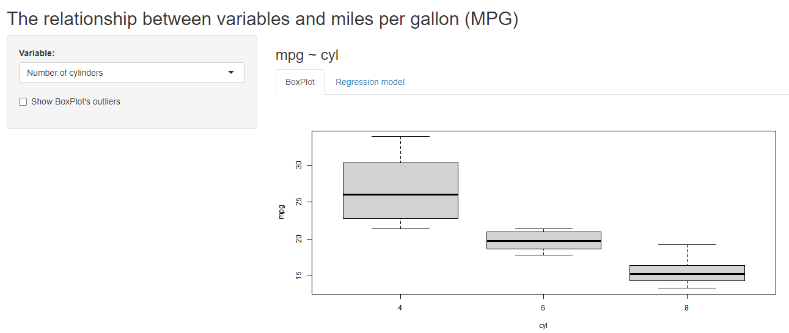

```{r setup, include=FALSE}
knitr::opts_chunk$set(echo = FALSE)
```


## Coursera Reproducible Pitch

This presentation is part of the Course Project for the Coursera Developing Data Products class. First, we need to create a Shiny application and deploy it on Rstudio's servers. Second, we should use Slidify or Rstudio Presenter to prepare a reproducible pitch presentation about the application.

The app developed for the first part of the assignment is avalilable at:

https://hrishi-kambli.shinyapps.io/Developing_Data_Products_Course_Project/

Source code for ui.R and server.R files are available on the GitHub:

https://github.com/kamblihrishikesh29/Developing_data_products


## mtcars Dataset

### Motor Trend Car Road Tests

> The data was extracted from the 1974 Motor Trend US magazine, and comprises fuel consumption and 10 aspects of automobile design and performance for 32 automobiles (1973-74 models). We can look to some carachteristics of the data:

```{r, echo=TRUE}
library(datasets)
head(mtcars, 3)
```

## The relationship between miles per gallon (MPG) and other variables

This app helps you to view the relationship of any variable in the mtcars dataset with the mpg variable.

First, you need to input the variable whose relationship with mpg you want to view. This information will be used to create a box plot of this variable versus mpg. Also, a linear model will be fit with these two variables it's plot and summary will be provided.

## Example

Here I have attached an screenshot of the app. I input transmission as the other variable and the app created a box plot of transmission vs mpg.

```{r, echo=FALSE}
   
```